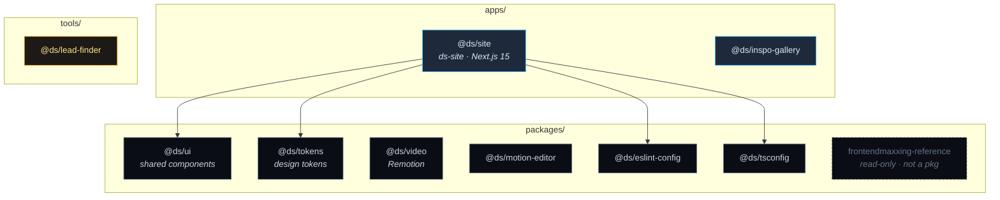

# DS monorepo, architecture snapshot

> Structural snapshot of the workspace and its internal (`@ds/*`) dependency edges.
> Regenerate when packages or cross-package deps change. GitHub renders the Mermaid below.

## Workspace dependency graph



## Reading it

- **`@ds/site` is the only integrator**, it consumes `@ds/tokens`, `@ds/ui`, and the shared `@ds/eslint-config` / `@ds/tsconfig`. Everything else is currently standalone.
- **`@ds/ui` does not yet depend on `@ds/tokens`**, worth wiring up so shared components pull from the token source rather than re-declaring values.
- **`@ds/inspo-gallery`, `@ds/video`, `@ds/motion-editor`, `@ds/lead-finder`** are independent (no internal deps yet).
- **`frontendmaxxing-reference`** is a read-only inspiration library (no `package.json`), ported *from*, never imported directly (per CLAUDE.md).

## Tree (top 2 levels)

```
DATHSTEL/
├── apps/        ds-site (Next.js 15), inspo-gallery
├── packages/    ui, tokens, video, motion-editor, eslint-config, tsconfig, frontendmaxxing-reference
├── tools/       lead-finder
└── docs/        brand/, ARCHITECTURE.md, DELIVERY-CHECKLIST.md, …
```

*For a deeper, queryable graph (call chains, per-symbol edges), drop a repo ZIP into [gitnexus.vercel.app](https://gitnexus.vercel.app), runs client-side, safe for this private repo.*
